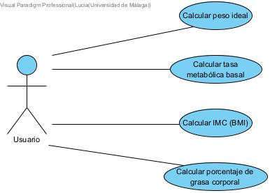

# isa2025-healthcalc
Health calculator used in Ingeniería del Software Avanzada

# PRÁCTICA 1

## Casos de prueba
En este apartado se enumerarán los casos de prueba desarrollados para que la calculadora funcione correctamente.

### 1. Comprobación del valor asignado a la altura
- La altura debe estar entre **30cm y 250cm** para un correcto funcionamiento de la calculadora. Alturas por debajo de 30cm o por encima de 250cm provocarían una excepcion en nuestra calculadora, ya que son valores muy poco frecuentes o casi inviables en nuestra sociedad.

### 2. Comprobación del género introducido
- Solo se aceptarán las entradas **'M'** (man) o **'W'** (woman), siendo estas correspondientes al sexo biológico predominante del individuo cuyos datos están siendo utilizados. Cualquier otro valor introducido provocará una excepción.

# PRÁCTICA 2
