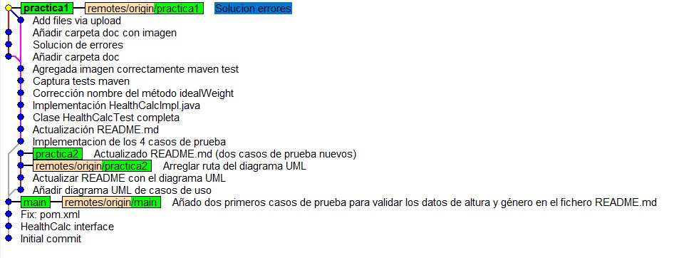

# isa2025-healthcalc
Health calculator used in Ingeniería del Software Avanzada

# PRÁCTICA 1

## Casos de prueba
En este apartado se enumerarán los casos de prueba desarrollados para que la calculadora funcione correctamente.

### 1. Comprobación del valor asignado a la altura
- La altura debe ser un número entero entre **30cm y 250cm** (inclusives) para un correcto funcionamiento de la calculadora. Alturas por debajo de 30cm o por encima de 250cm provocarían una excepcion en la calculadora, ya que son valores muy poco frecuentes o casi inviables en nuestra sociedad.

### 2. Comprobación del género introducido
- Solo se aceptarán las entradas **'M'** (man) o **'W'** (woman), siendo estas correspondientes al sexo biológico del individuo cuyos datos están siendo utilizados. Cualquier otro valor introducido provocará una excepción en la calculadora.

### 3. Comprobación del valor asignado al peso
- Solo se aceptarán pesos dento de un rango lógico, entre **3kg y 400kg** (inclusives), para asegurar que los datos introducidos sean correctos. Pesos por debajo de 3kg o por encima de 400kg provocarían una excepción en la calculadora, ya que se entendería que se trata de un error de escritura.

### 4. Comprobación de la edad
- El valor introducido para la edad debe ser un número entero entre **1 y 120** (inclusives). Cualquier otro tipo de dato provocará una excepción en la calculadora.

## Ejecución de los casos de prueba utilizando maven
- Una vez realizada la implementacion de los casos de prueba y de los métodos requeridos, realizamos los tests utilizando en el cmd del ordenador **mvn test**. A continuación, se adjunta una imagen del resultado obtenido, comprobando que los tests se han pasado correctamente.

## Commits realizados
- Hasta ahora, los commits realizados son los siguientes (vistos con gitk):

# PRÁCTICA 2

## Diagrama de casos de uso

## Descripción del caso "Calcular peso ideal"

### 1.Nombre:
- Calcular peso ideal
### 2.Actor principal:
- Usuario (persona interesada en conocer su peso ideal)
### 3.Ámbito:
- Calculadora de salud
### 4.Nivel:
- Caso de uso de usuario
### 5.Stakeholders e intereses:
- Usuario: Quiere conocer su peso ideal según su altura y género.
- Desarrollador: Desea que el sistema ofrezca un cálculo rápido y preciso.
- Profesional sanitario: Pueden usar esta herramienta como apoyo y recomendaciones.
### 6.Precondiciones:
- El usuario tiene que proporcionar su altura en centímetros dentro del rango permitido (30cm - 250cm).
- El usuario debe ingresar su género con el carácter 'M' (hombre) o 'W' (mujer).
### 7.Garantías:
- El sistema valida los datos ingresados.
- Se muestra un mensaje si los datos no son válidos.
- Se muestra el peso ideal basado en la fórmula.
- La información se presenta de manera clara y comprensible.
### 8.Escenario principal:
1- El usuario accede a la calculadora de salud.
2- Se selecciona la opción "Calcular peso ideal".
3- Ingresa su altura en centímetros.
4- Ingresa su género.
5- El sistema valida los datos ingresados.´
6- El sistema calcula el peso ideal usando la fórmula de Lorentz.
7- Se muestra por pantalla el resultado.
### 9.Escenarios alternativos:
A1: El usuario ingresa la altura fuera del rango permitido -> Se lanza una excepción con el mensaje "La altura debe estar entre 30cm y 250cm".
A2: El usuario ingresa un género no válido -> Se lanza una excepción con el mensaje "El género debe ser M para hombres o W para mujeres. Revise las mayúsculas.".
### 10.Extensiones:
E1: Permitir que el usuario seleccione entre diferentes fórmulas para calcular el peso ideal.
E2: Mostrar un mensaje con recomendaciones de salud basadas en el resultado obtenido.
E3: Guardar el peso ideal en el perfil del usuario si la aplicación permite el registro de datos.

# PRÁCTICA 3

##  IDEAL WEIGHT
### Historia de usuario
- **Como** usuario de la calculadora de salud

- **Quiero** calcular el peso ideal de una persona basado en su altura y género

- **Para** poder determinar si mi peso es saludable según la fórmula de Lorentz

### Criterios de aceptación

#### Escenario 1: Calcular el peso ideal para un hombre
- **Dado** que el usuario ha ingresado su altura (180 cm) y género (M)

- **Cuando** el sistema calcula el peso ideal

- **Entonces** el sistema debe mostrar un peso ideal de 80 kg según la fórmula de Lorentz

#### Escenario 2: Calcular el peso ideal para una mujer
- **Dado** que el usuario ha ingresado su altura (165 cm) y género (W)

- **Cuando** el sistema calcula el peso ideal

- **Entonces** el sistema debe mostrar un peso ideal de 62,5 kg según la fórmula de Lorentz

#### Escenario 3: Error debido a altura inválida
- **Dado** que el usuario ha ingresado una altura inválida (20 cm)

- **Cuando** el sistema intenta calcular el peso ideal

- **Entonces** el sistema debe lanzar una excepción con el mensaje "La altura debe estar entre 30 cm y 250 cm"

#### Escenario 4: Error debido a género inválido
- **Dado** que el usuario ha ingresado un género inválido (X)

- **Cuando** el sistema intenta calcular el peso ideal

- **Entonces** el sistema debe lanzar una excepción con el mensaje "El género debe ser M para hombres o W para mujeres. Revise mayúsculas"

## BASAL METABOLIC RATE
### Historia de usuario
- **Como** usuario de la calculadora de salud

- **Quiero** calcular la tasa metabólica basal de una persona basada en su peso, altura, edad y género

- **Para** poder determinar la cantidad de calorías que necesito para mantener mi cuerpo en reposo

### Criterios de aceptación
#### Escenario 1: Calcular BMR para un hombre
- **Dado** que el usuario ha ingresado su peso (70 kg), altura (175 cm), edad (30 años) y género (M)

- **Cuando** el sistema calcula la tasa metabólica basal

- **Entonces** el sistema debe mostrar una TMB de 1.786 kcal/día usando la fórmula de Harris-Benedict

#### Escenario 2: Calcular BMR para una mujer
- **Dado** que el usuario ha ingresado su peso (60 kg), altura (160 cm), edad (28 años) y género (W)

- **Cuando** el sistema calcula la tasa metabólica basal

- **Entonces** el sistema debe mostrar una TMB de 1.414 kcal/día usando la fórmula de Harris-Benedict

#### Escenario 3: Error debido a peso inválido
- **Dado** que el usuario ha ingresado un peso inválido (1 kg)

- **Cuando** el sistema intenta calcular la tasa metabólica basal

- **Entonces** el sistema debe lanzar una excepción con el mensaje "El peso debe estar entre 3 kg y 400 kg"

#### Escenario 4: Error debido a altura inválida
- **Dado** que el usuario ha ingresado una altura inválida (10 cm)

- **Cuando** el sistema intenta calcular la tasa metabólica basal

- **Entonces** el sistema debe lanzar una excepción con el mensaje "La altura debe estar entre 30 cm y 250 cm"

#### Escenario 5: Error debido a edad inválida
- **Dado** que el usuario ha ingresado una edad inválida (0 años)

- **Cuando** el sistema intenta calcular la tasa metabólica basal

- **Entonces** el sistema debe lanzar una excepción con el mensaje "La edad debe estar entre 1 año y 120 años"

#### Escenario 6: Error debido a género inválido
- **Dado** que el usuario ha ingresado un género inválido (X)

- **Cuando** el sistema intenta calcular la tasa metabólica basal

- **Entonces** el sistema debe lanzar una excepción con el mensaje "El género debe ser M para hombres o W para mujeres. Revise mayúsculas"