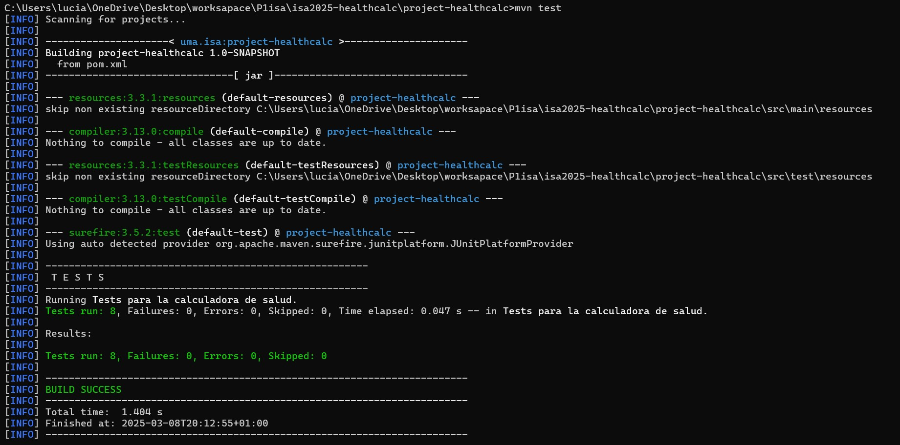

# isa2025-healthcalc
Health calculator used in Ingeniería del Software Avanzada

# PRÁCTICA 1

## Casos de prueba
En este apartado se enumerarán los casos de prueba desarrollados para que la calculadora funcione correctamente.

### 1. Comprobación del valor asignado a la altura
- La altura debe ser un número entero entre **30cm y 250cm** (inclusives) para un correcto funcionamiento de la calculadora. Alturas por debajo de 30cm o por encima de 250cm provocarían una excepcion en la calculadora, ya que son valores muy poco frecuentes o casi inviables en nuestra sociedad.

### 2. Comprobación del género introducido
- Solo se aceptarán las entradas **'M'** (man) o **'W'** (woman), siendo estas correspondientes al sexo biológico del individuo cuyos datos están siendo utilizados. Cualquier otro valor introducido provocará una excepción en la calculadora.

### 3. Comprobación del valor asignado al peso
- Solo se aceptarán pesos dento de un rango lógico, entre **3kg y 400kg** (inclusives), para asegurar que los datos introducidos sean correctos. Pesos por debajo de 3kg o por encima de 400kg provocarían una excepción en la calculadora, ya que se entendería que se trata de un error de escritura.

### 4. Comprobación de la edad
- El valor introducido para la edad debe ser un número entero entre **1 y 120** (inclusives). Cualquier otro tipo de dato provocará una excepción en la calculadora.

## Ejecución de los casos de prueba utilizando maven
- Una vez realizada la implementacion de los casos de prueba y de los métodos requeridos, realizamos los tests utilizando en el cmd del ordenador **mvn test**. A continuación, se adjunta una imagen del resultado obtenido, comprobando que los tests se han pasado correctamente.

