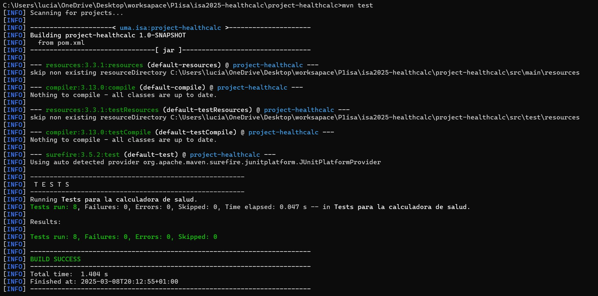
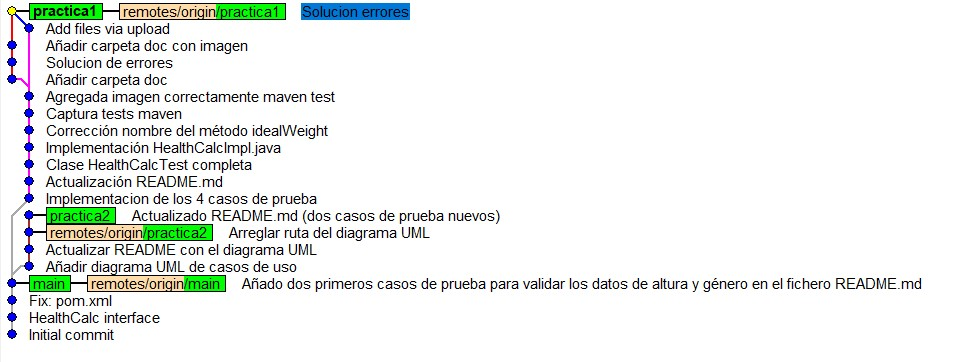
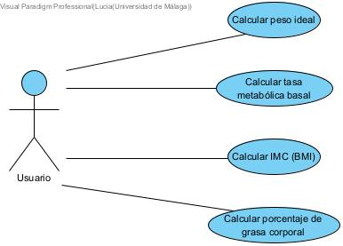
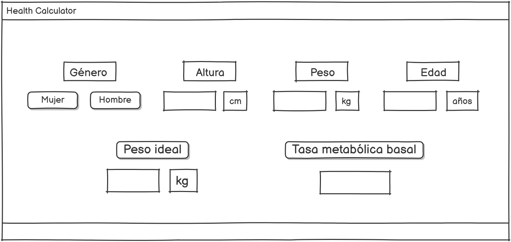
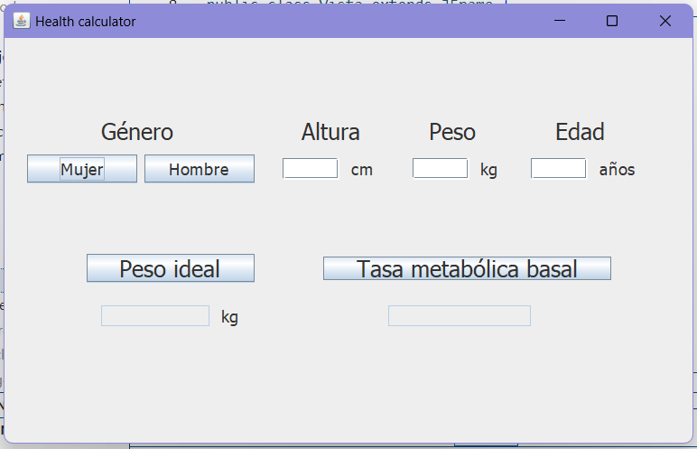
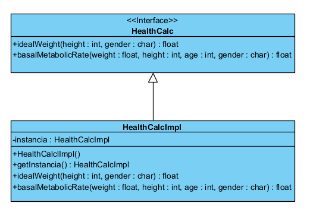
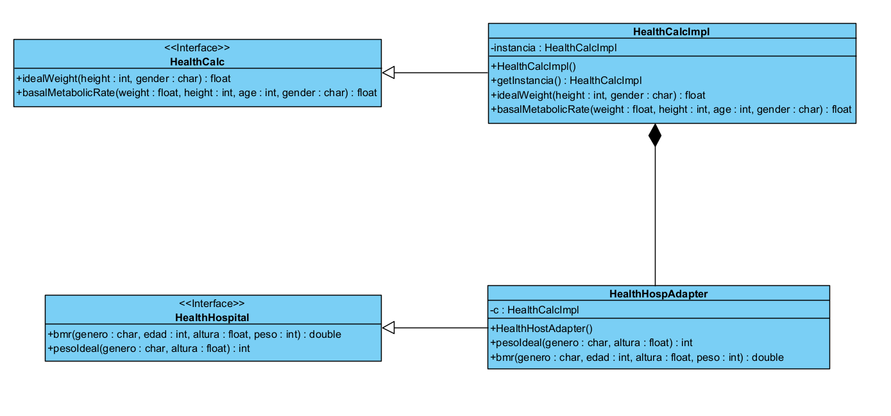
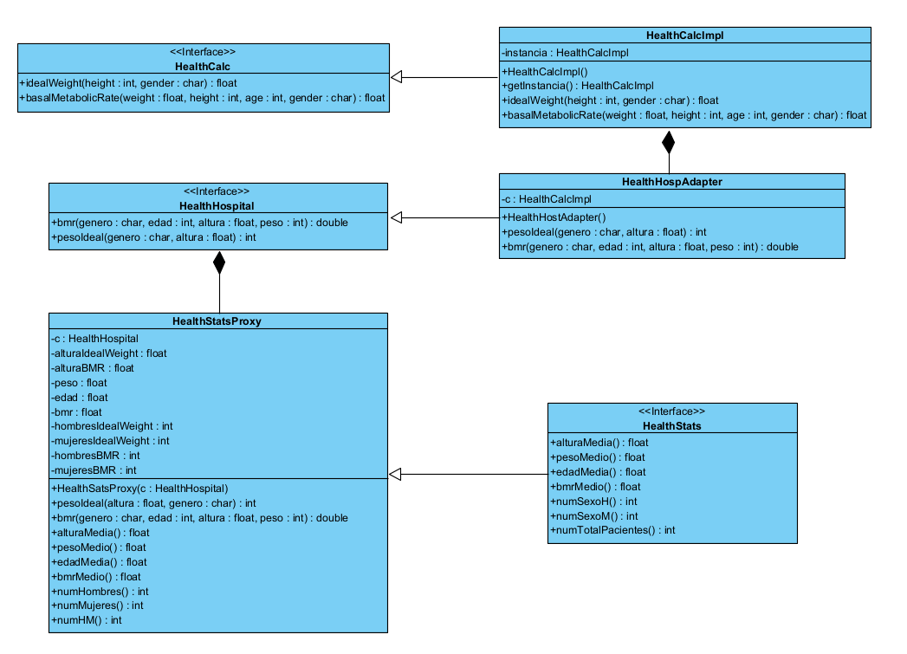
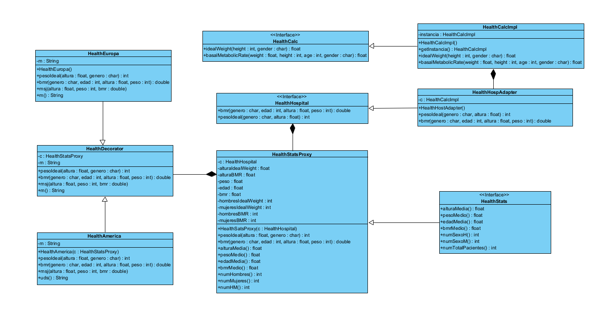

# isa2025-healthcalc
Health calculator used in Ingeniería del Software Avanzada

# PRÁCTICA 1

## Casos de prueba
En este apartado se enumerarán los casos de prueba desarrollados para que la calculadora funcione correctamente.

### 1. Comprobación del valor asignado a la altura
- La altura debe ser un número entero entre **30cm y 250cm** (inclusives) para un correcto funcionamiento de la calculadora. Alturas por debajo de 30cm o por encima de 250cm provocarían una excepcion en la calculadora, ya que son valores muy poco frecuentes o casi inviables en nuestra sociedad.

### 2. Comprobación del género introducido
- Solo se aceptarán las entradas **'M'** (man) o **'W'** (woman), siendo estas correspondientes al sexo biológico del individuo cuyos datos están siendo utilizados. Cualquier otro valor introducido provocará una excepción en la calculadora.

### 3. Comprobación del valor asignado al peso
- Solo se aceptarán pesos dento de un rango lógico, entre **3kg y 400kg** (inclusives), para asegurar que los datos introducidos sean correctos. Pesos por debajo de 3kg o por encima de 400kg provocarían una excepción en la calculadora, ya que se entendería que se trata de un error de escritura.

### 4. Comprobación de la edad
- El valor introducido para la edad debe ser un número entero entre **1 y 120** (inclusives). Cualquier otro tipo de dato provocará una excepción en la calculadora.

## Ejecución de los casos de prueba utilizando maven
- Una vez realizada la implementacion de los casos de prueba y de los métodos requeridos, realizamos los tests utilizando en el cmd del ordenador **mvn test**. A continuación, se adjunta una imagen del resultado obtenido, comprobando que los tests se han pasado correctamente.

## Commits realizados
- Hasta ahora, los commits realizados son los siguientes (vistos con gitk):

# PRÁCTICA 2

## Diagrama de casos de uso

## Descripción del caso "Calcular peso ideal"

### 1.Nombre:
- Calcular peso ideal
### 2.Actor principal:
- Usuario (persona interesada en conocer su peso ideal)
### 3.Ámbito:
- Calculadora de salud
### 4.Nivel:
- Caso de uso de usuario
### 5.Stakeholders e intereses:
- Usuario: Quiere conocer su peso ideal según su altura y género.
- Desarrollador: Desea que el sistema ofrezca un cálculo rápido y preciso.
- Profesional sanitario: Pueden usar esta herramienta como apoyo y recomendaciones.
### 6.Precondiciones:
- El usuario tiene que proporcionar su altura en centímetros dentro del rango permitido (30cm - 250cm).
- El usuario debe ingresar su género con el carácter 'M' (hombre) o 'W' (mujer).
### 7.Garantías:
- El sistema valida los datos ingresados.
- Se muestra un mensaje si los datos no son válidos.
- Se muestra el peso ideal basado en la fórmula.
- La información se presenta de manera clara y comprensible.
### 8.Escenario principal:
1- El usuario accede a la calculadora de salud.
2- Se selecciona la opción "Calcular peso ideal".
3- Ingresa su altura en centímetros.
4- Ingresa su género.
5- El sistema valida los datos ingresados.´
6- El sistema calcula el peso ideal usando la fórmula de Lorentz.
7- Se muestra por pantalla el resultado.
### 9.Escenarios alternativos:
A1: El usuario ingresa la altura fuera del rango permitido -> Se lanza una excepción con el mensaje "La altura debe estar entre 30cm y 250cm".
A2: El usuario ingresa un género no válido -> Se lanza una excepción con el mensaje "El género debe ser M para hombres o W para mujeres. Revise las mayúsculas.".
### 10.Extensiones:
E1: Permitir que el usuario seleccione entre diferentes fórmulas para calcular el peso ideal.
E2: Mostrar un mensaje con recomendaciones de salud basadas en el resultado obtenido.
E3: Guardar el peso ideal en el perfil del usuario si la aplicación permite el registro de datos.

# PRÁCTICA 3

##  IDEAL WEIGHT
### Historia de usuario
- **Como** usuario de la calculadora de salud

- **Quiero** calcular el peso ideal de una persona basado en su altura y género

- **Para** poder determinar si mi peso es saludable según la fórmula de Lorentz

### Criterios de aceptación

#### Escenario 1: Calcular el peso ideal para un hombre
- **Dado** que el usuario ha ingresado su altura (180 cm) y género (M)

- **Cuando** el sistema calcula el peso ideal

- **Entonces** el sistema debe mostrar un peso ideal de 80 kg según la fórmula de Lorentz

#### Escenario 2: Calcular el peso ideal para una mujer
- **Dado** que el usuario ha ingresado su altura (165 cm) y género (W)

- **Cuando** el sistema calcula el peso ideal

- **Entonces** el sistema debe mostrar un peso ideal de 62,5 kg según la fórmula de Lorentz

#### Escenario 3: Error debido a altura inválida
- **Dado** que el usuario ha ingresado una altura inválida (20 cm)

- **Cuando** el sistema intenta calcular el peso ideal

- **Entonces** el sistema debe lanzar una excepción con el mensaje "La altura debe estar entre 30 cm y 250 cm"

#### Escenario 4: Error debido a género inválido
- **Dado** que el usuario ha ingresado un género inválido (X)

- **Cuando** el sistema intenta calcular el peso ideal

- **Entonces** el sistema debe lanzar una excepción con el mensaje "El género debe ser M para hombres o W para mujeres. Revise mayúsculas"

## BASAL METABOLIC RATE
### Historia de usuario
- **Como** usuario de la calculadora de salud

- **Quiero** calcular la tasa metabólica basal de una persona basada en su peso, altura, edad y género

- **Para** poder determinar la cantidad de calorías que necesito para mantener mi cuerpo en reposo

### Criterios de aceptación
#### Escenario 1: Calcular BMR para un hombre
- **Dado** que el usuario ha ingresado su peso (70 kg), altura (175 cm), edad (30 años) y género (M)

- **Cuando** el sistema calcula la tasa metabólica basal

- **Entonces** el sistema debe mostrar una TMB de 1.786 kcal/día usando la fórmula de Harris-Benedict

#### Escenario 2: Calcular BMR para una mujer
- **Dado** que el usuario ha ingresado su peso (60 kg), altura (160 cm), edad (28 años) y género (W)

- **Cuando** el sistema calcula la tasa metabólica basal

- **Entonces** el sistema debe mostrar una TMB de 1.414 kcal/día usando la fórmula de Harris-Benedict

#### Escenario 3: Error debido a peso inválido
- **Dado** que el usuario ha ingresado un peso inválido (1 kg)

- **Cuando** el sistema intenta calcular la tasa metabólica basal

- **Entonces** el sistema debe lanzar una excepción con el mensaje "El peso debe estar entre 3 kg y 400 kg"

#### Escenario 4: Error debido a altura inválida
- **Dado** que el usuario ha ingresado una altura inválida (10 cm)

- **Cuando** el sistema intenta calcular la tasa metabólica basal

- **Entonces** el sistema debe lanzar una excepción con el mensaje "La altura debe estar entre 30 cm y 250 cm"

#### Escenario 5: Error debido a edad inválida
- **Dado** que el usuario ha ingresado una edad inválida (0 años)

- **Cuando** el sistema intenta calcular la tasa metabólica basal

- **Entonces** el sistema debe lanzar una excepción con el mensaje "La edad debe estar entre 1 año y 120 años"

#### Escenario 6: Error debido a género inválido
- **Dado** que el usuario ha ingresado un género inválido (X)
git 
- **Cuando** el sistema intenta calcular la tasa metabólica basal

- **Entonces** el sistema debe lanzar una excepción con el mensaje "El género debe ser M para hombres o W para mujeres. Revise mayúsculas"

# PRÁCTICA 4
## Intrefaz gráfica de usuario
### Balsamiq
En primer lugar, se ha realizado un boceto de la interfaz de la calculadora.

Para que la aplicación funcione correctamente, se ha utilizado windows builder para realizar la interfaz gráfica definitica.

# PRÁCTICA 6
## Patrón Singleton
Hemos aplicado el patrón de tal manera que solo se permita tener una instancia de la calculadora.

## Patrón Adapter
El patrón Adapter ha sido elegido ya que se nos proporciona una interfaz unificada que permite a los objetos con interfaz incompatible colaborar. Tenemos unca clase existente pero su interfaz no concuerda con lo que necesitamos, de manera que *adaptaremos* sus objetos.

## Patron Proxy
El patrón Proxy ha sido elegido ya que nos permite proporcionar un sustituto para otro objeto, controlando el acceso al objeto original. Tenemos una interfaz *HealthStats* cuyo objetivo es el de llevar un registro de todos los movimientos hechos en la calculadora, es decir, buscamos controlar el acceso a nuestra calculadora.

## Patron Decorator
El patrón Proxy ha sido elegido ya que nos permite añadir nuevos comportamientos a los objetos, colocando estos objetos dentro de otros envolventes especiales que contienen los comportamientos. De esta manera, añadimos los nuevos comportamientos de nuestra calcualdora, dependiendo de si se va a usar en América o en Europa.

# PRÁCTICA 7

## 1. Género (char -> enum)

* **Bad Smell**
	- Este refactoring aborda principalmente el problema conocido como Primitive Obssesion, que consiste en el uso excesivo de tipos primitivos para representar información que podría encapsularse mejor mediante tipos específicos o estructuras más apropiadas.
* **Refactorings aplicados**
	- Introduce Enum: Se ha introducido un tipo enum para representar un conjunto limitado de valores concretos.
	- Replace Value with Object: Se ha sustituido el uso de un valor primitivo por un objeto que encapsula mejor el concepto. 
* **Categoría del refactoring**
	- Este refactoring se clasifica como una Attribute Refactoring, ya que transforma una variable basada en un tipo primitivo hacia un tipo más específico y expresivo.
* **Descripción**
	- La refactorización consiste en sustituir una variable de tipo char utilizada para indicar el género del usuario por un tipo enum denominado Gender. Este cambio aporta mayor claridad al código y previene errores, al limitar los valores posibles a opciones explícitas (MALE, FEMALE). Además, se ha creado el nuevo tipo enumerado y se han actualizado todas las referencias previas al char en el código para adaptarlas al nuevo enum.
* **Registro de cambios manuales**
	- Creación del enum Gender
	- Todos los atributos, parámetros y retornos de tipo char que representan el género se han sustituido por el tipo Gender.
	- Todos los métodos que reciben char genero como parámetro, ahora reciben Gender genero.
	- Se elimina cualquier validación de 'M' o 'W' por Gender.MALE o Gender.FEMALE.
	- Las interfaces HealthCalc y HealthHospital se actualizan para ecibir Gender en lugar de char.
	- Se modifican todas las clases que implementan dichas interfaces para adaptarse a los nuevos tipos.
	- La clase Vista se actualiza para almacenar el género como un Gender y devolverlo a través del método getGeneroSeleccionado(). Los botones de selección de género asignan Gender.MALE o Gender.FEMALE.
	- Todas las pruebas automatizadas se actualizan para usar Gender en lugar de char, eliminando pruebas que no son necesarias. 

## 2. Height, weight, age, gender -> Person

* **Bad Smell**
	- Este refactoring aborda el problema conocido como Data Clumps, que se da cuaddo un conjunto de datos aparece repetidamente agrupado en múltiples métodos y clases, lo cual indica que deberían encapsularse juntos en una clase dedicada.
* **Refactorings aplicados**
	- Move Field: Se han trasladado los atributos height, wieght, age y gender desde diversas clases hacia una nueva clase Person.
	- Encapsulate Field: Los nuevos atributos de Person se han encapsulado mediante métodos de acceso, asegurando así un control adecuado sobre el acceso y modificación de los datos.
* **Categoría del refactoring**
	- Este refactoring se clasifica como un Class Refactoring, ya que consiste en reoganizar la estructura del sistema introduciendo una nueva clase que encapsula responsabilidades previamente dispersas.
* **Descripción**
	- Se ha creado una nueva clase llamada Person, que agrupa de forma lógica los atributos height, weight, age y gender. La refactorización implicó actualizar múltiples clases para que ahora trabajen con una instancia de Person en lugar de pasar estos campos como parámetros individuales. este cambio mejora la legibilidad y claridad del código, reduce la duplicación de parámetros, favorece la reutilización de lógica relacionada con el usuario y realiza los datos personales en un único punto del sistema.
* **Registro de cambios manuales**
	- Creación de la clase Person que encapsula los atributos height, weight, age y gender.
	- Todos los métodos que recibían como parámetros combianciones de height, weight, age y gender ahora reciben un único objeto Person.
	- Las interfaces se actualizan apra que sus métodos reciban un Person como parámetro. Las clases que implementan estas interfaces adaptan su implementación.
	- La lógica de validación y cálculo reutiliza los métodos originales usando getters de Person, eliminando la necesidad de pasar atributos individualmente.
	- La clase Vista añade el método getPerson() que construye y devuelve una instancia de Person.
	- Las llamadas desde Controlador se modifican para usar getPerson().
	- Todas las clases se adaptan para trabajar con Person y se realizan las conversiones necesarias dentro del objeto o creando una nueva instancia adaptada.
	- Todas las clases de pruebas se refactorizan para construir un objeto person en lugar de pasar valores sueltos.
	- La validación de rangos y lógica condicional se raliza a través de person.get.
		
## 3. Interfaces CardivarcularMetrics y MetabolicMetrics

* **Bad Smell**
	- Este refactoring responde al problema conocido como Large Class (Clase Dios). La clase original estaba asumiendo múltiples responsabilidades al implementar tanto el cálculo del peso ideal como la tasa metabólica basal, violando así el principio de responsabilidad única.
* **Refactorings aplicados**
	- Se ha aplicado el patrón de refactorización Extract Class, dividiendo las responsabilidades en  nuevas unidades funcionales. En lugar de mantener métodos con funcionalidades dispares en una sola clase, se han creado interfaces específicas que agrupan métodos coherentes entre sí.
* **Categoría del refactoring**
	- Este es un Class Refactoring, ya que implica la creación de nuevas clases o interfaces para redistribuir funcionalidades existentes de forma más cohesiva y desacoplada.
* **Descripción**
	- CardivarcularMetrics define el método relacionado con el peso ideal.
	- MetabolicMetrics define el método de cálculo de la tasa metabólica basal.
* **Registro de cambios manuales**
	- Se han creado dos nuevas interfaces CardiovascualrMetrics y MetabolicMetrics.
	- La clase HealthCalcImpl implementa ambas interfaces.
	- El método idealWeight se ha trasladado a la interfaz CardiovarcularMetrics.
	- El método basalMetabolicRate se ha trasladado a la interfaz MetabolicMetrics.
	- Todas las clases que necesitaban acceder a estas funcionalidades has sido actualizadas para hacer casting o declarar las dependencias con el tipo correcto.